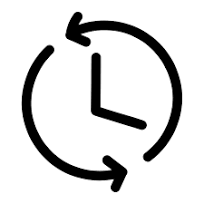

# CRON-JOB
# CRON-JOB (synchronize Job) with Odoo 13

# Description
This readme provides information on how to use the Cron Job model in Odoo 13. Cron jobs are automated tasks that run at specified intervals to perform various functions, such as sending emails, updating data, or running maintenance scripts.

## Model Name
The model name for Cron Jobs in Odoo 13 is ir.cron.

## Fields
The ir.cron model has the following fields:

- **name**: A human-readable name for the cron job.
- **model**: The model that the cron job will operate on.
- **function**: The name of the function to be called when the cron job runs.
- **interval_number**: The number of intervals between each run of the cron job.
- **interval_type**: The type of interval to use. Can be minutes, hours, days, weeks, or months.
- **nextcall**: The date and time of the next scheduled run for the cron job.
- **active**: A flag indicating whether the cron job is active or not.
- **args**: Additional arguments to pass to the function.
- **state**: The current state of the cron job. Can be 'code', 'active', or 'done'.

# Usage
- To create a new cron job, navigate to the Configuration menu, then select Technical > Automation > Scheduled Actions. Click the "Create" button to create a new cron job. Fill in the required fields and save the record.

- To view or edit an existing cron job, navigate to the Scheduled Actions list and search for the job you want to modify. Click on the job to open it in edit mode.

- To delete a cron job, select the job from the Scheduled Actions list and click the "Delete" button.